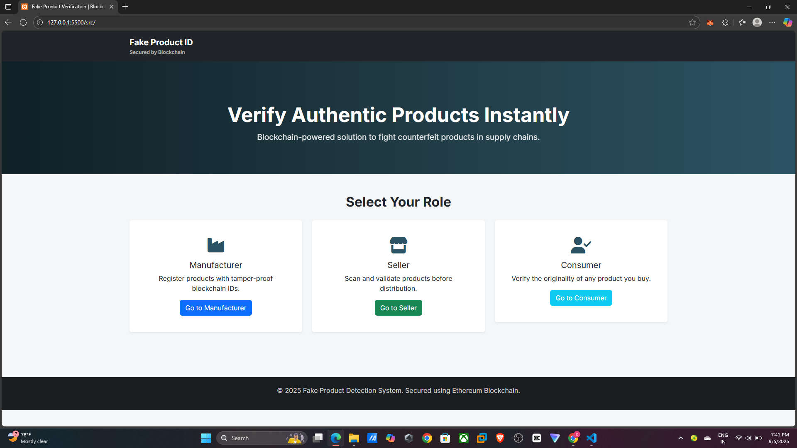
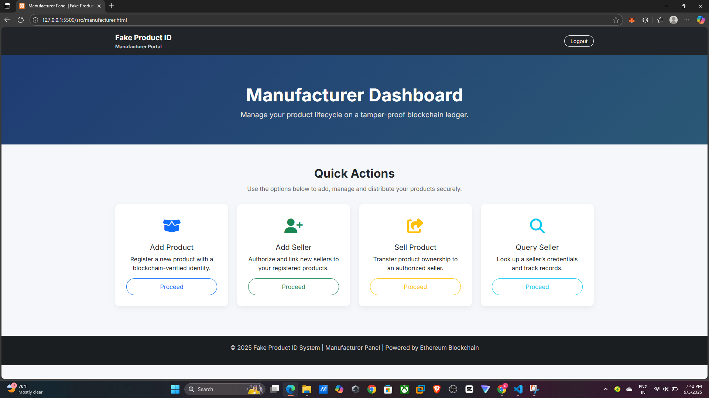
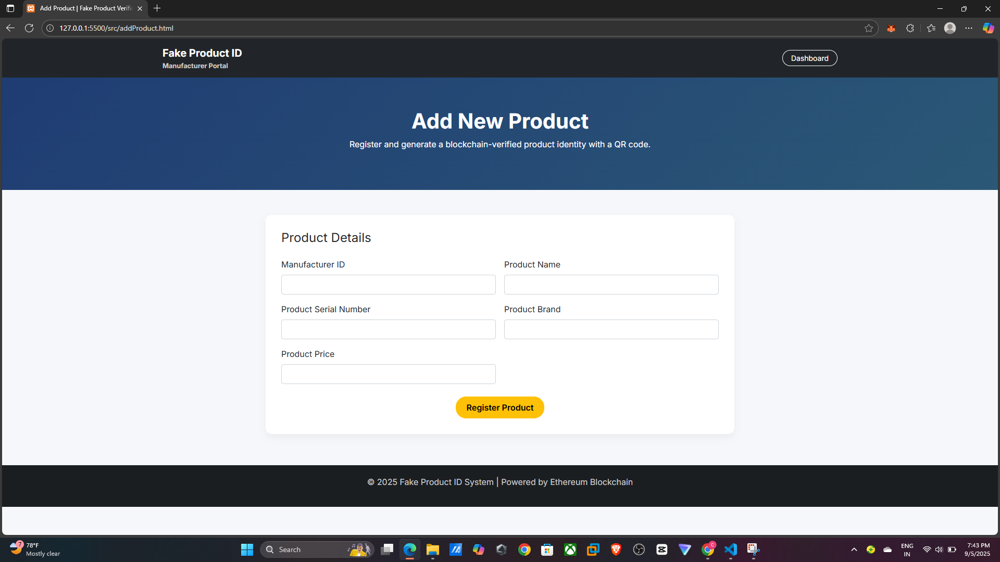
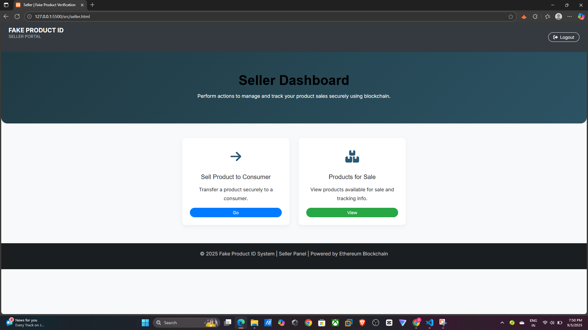
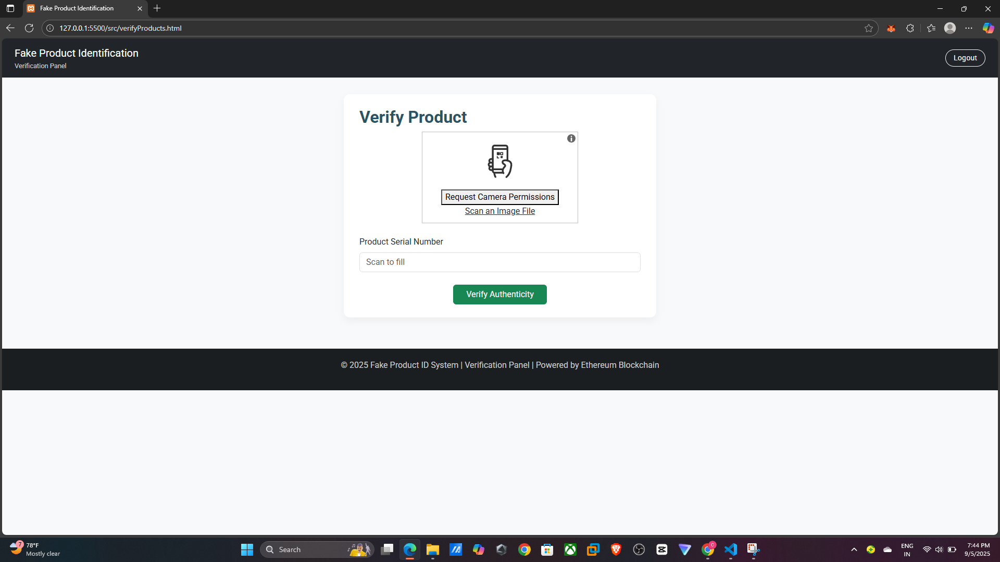

🛡️ Fake Product Identification using Blockchain

A decentralized system to verify product authenticity and prevent counterfeit goods using blockchain technology.
This project ensures transparency between manufacturers, distributors, and customers by integrating Ethereum smart contracts with a user-friendly interface.

📦 Packages Required

Truffle v5.6.7 (core: 5.6.7)

Ganache v7.5.0

Solidity v0.5.16 (solc-js)

Node.js v15.8.0

Web3.js v1.7.4

npm v7.5.1

🌐 Other Requirements

Any Chromium-based browser (e.g., Chrome)

Metamask browser extension

⚙️ Setup Process
1️⃣ Clone the Project
git clone https://github.com/A4ANK/Fake-Product-Identification.git

2️⃣ Install Dependencies
cd Fake-Product-Identification
npm install

3️⃣ Compile Smart Contracts
truffle compile

4️⃣ Setup Local Blockchain with Ganache

Open Ganache

Create a new workspace

Add truffle-config.js from the project

Update server settings:

Port: 7545 (same as in truffle-config.js)

5️⃣ Configure Metamask

Add new test network:

Network ID: 5777 (from Ganache)

RPC URL: http://127.0.0.1:7545

Chain ID: 1337

Import account using private key from Ganache

6️⃣ Deploy Contracts
truffle migrate

7️⃣ Start Development Server
npm run dev

👉 This will open the homepage (index.html) in your default browser.

8️⃣ Connect Metamask

Login to Metamask

Connect account to localhost:3000

9️⃣ Interact with the Website 🎉
📸 Preview (Optional)
 
 
 
 
 

🛠️ Tech Stack

Ethereum Blockchain

Solidity – Smart contracts

Truffle Suite – Development & testing framework

Ganache – Local blockchain

Web3.js – Blockchain interaction

Node.js – Backend support

Metamask – Wallet & account management

🚀 Future Enhancements

🔗 Integration with IPFS for decentralized storage

📱 Mobile-friendly dApp interface

✅ QR Code-based product verification

🤝 Contributing

Pull requests are welcome! For major changes, please open an issue first to discuss what you’d like to improve.